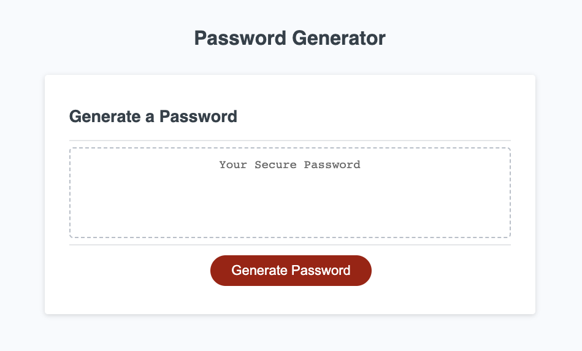
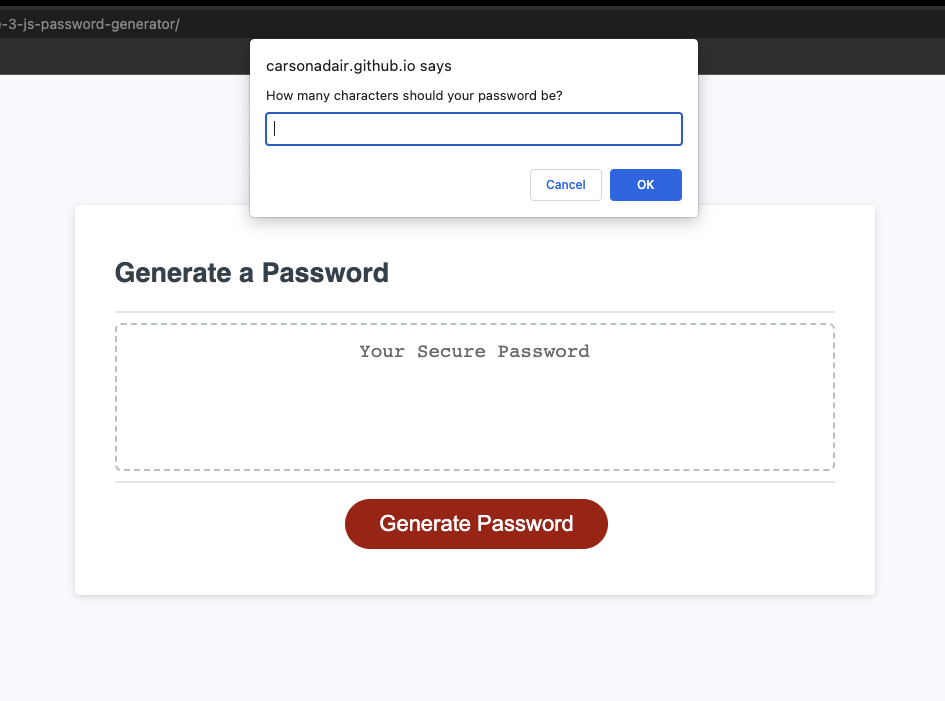
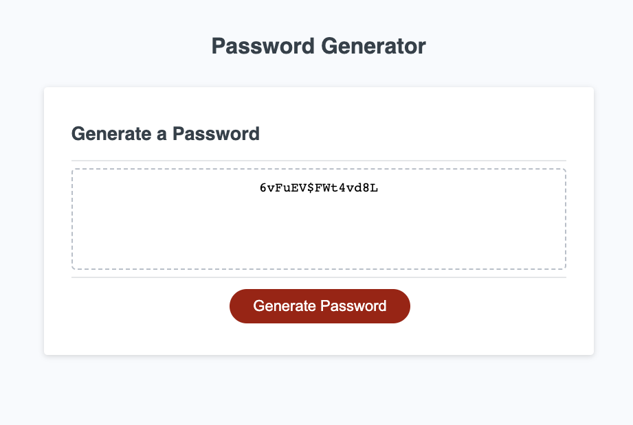

#Challenge 3

In this challenge I edited the JavaScript code for this password generator to add a pop up box prompting specifications for the password, including length between 8 and 128 characters, upper and lowercase letters, numbers, and special symbols. The function then resulted in a password with those set properties showing up in the text box. Each click and set of prompts results in a new, random string for a password. 

Here is a picture of the deployed application. 

